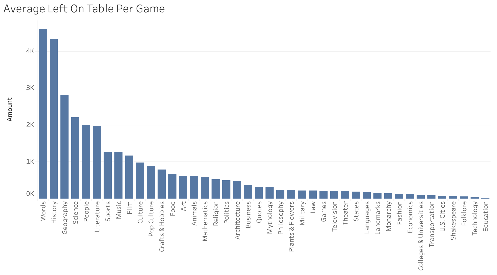

# Jeopardy! Season 40 Personal Performance
Tracking my performance across *Jeopardy!*'s 40th season

## Objective
As a lifelong fan of *Jeopardy!*, it's always been a dream of mine to appear on the show. I made it into the contestant pool once before, but didn't wind up getting The Call during my window of eligibility. But it's just as well, because while I may have what it takes to become a contestant, I don't feel confident that I could win a game... yet. 

Studying for *Jeopardy!* is a well-trod topic. Some *Jeopardy!* hopefuls pore over thousands of flash cards. Others trawl Wikipedia. Superchamp Brad Rutter has often said that the best way to get better at *Jeopardy!* is to watch *Jeopardy!*. While I agree with that general sentiment, after decades of nightly viewing, I could stand to be more strategic. Rather than cast a wide net, I want to focus my studying where it'll come in most handy. And I'm using real data to determine what those topics are, and how much I need to improve to reliably win.

## Project Scope
For the initial phase of this project, all findings and analysis were collected from the first 80 games of *Jeopardy!* Season 40, airing between 9/11/2023 and 12/29/2023. I chose not to undergo any supplemental prep or study during this time, so these games serve as my baseline.

## Hypotheses and Goals
My main goal is to identify the top three categories with the largest opportunity for improvement - based on a combination of the frequency with which they show up, and my accuracy in response. Going into this project, I suspected that History would be at the top of that list, but I was less sure about other oft-touted *Jeopardy!* standbys like Shakespeare, Opera, and the Bible.

## Data Collection
After playing along with each game in real time, I entered clue-by-clue stats and information into a Google Sheet. I calculated my [Coryat Score](https://j-archive.com/help.php#coryatscore) for each game, and collected additional game data on contestant performance.

## Data Description
I exported the data from Google Sheets into two csv tables.

`jeopardy_data.csv` includes the following columns:
- Game - the episode ID number of the game (and the primary key for both tables)
- Round - Jeopardy!, Double Jeopardy! or Final Jeopardy!
- Category - The category title as displayed during the game
- Metacategory - The larger subject the category falls into (i.e. - History, Shakespeare, Film, etc)
- Value - The face value of the clue, ranging from $200 to $1000 during the Jeopardy! round, $400 to $2000 during the Double Jeopardy! round, and $0 for Final Jeopardy!
- Response - How I answered: Correct, Incorrect, or Did Not Ring In
- DD - Whether the clue was a Daily Double

`jeopardy_coryats.csv` includes the following columns:
- Game - the episode ID number of the game (and the primary key for both tables)
- Date - the date the episode aired
- GameType - Second Chance Tournament or Champions Wildcard Tournament
- MyCoryat - My Coryat Score
- CombinedCoryat - the combined Coryat score for all contestants
- Contestant1Coryat - Contestant 1's Coryat score
- Contestant2Coryat - Contestant 2's Coryat score
- Contestant3Coryat - Contestant 3's Coryat score
- Contestant1FJ - Contestant 1's Final Jeopardy outcome (T for correct, F for incorrect)
- Contestant2FJ - Contestant 2's Final Jeopardy outcome (T for correct, F for incorrect)
- Contestant3FJ - Contestant 3's Final Jeopardy outcome (T for correct, F for incorrect)
- Contestant1Win - Contestant 1's game outcome (T for win, F for lose)
- Contestant2Win - Contestant 2's game outcome (T for win, F for lose)
- Contestant3Win - Contestant 3's game outcome (T for win, F for lose)

## Challenges and Limitations
#### Tournament Play Only (So Far)
Thanks to the 2023 Writers Strike, the Season 40 schedule was frontloaded with special tournaments, which tend to contain tougher material than regular season play. This could present some misleading data about my knowledge baseline, skewing my average lower than typical. However, I figure that it can only help my regular gameplay odds if I set my sights on studying to win the average tournament game. Additionally, since I am tracking game type in my data, I will account for tournament-vs-regular differences in my final analysis once the entire season has aired.

#### Metacategories
Identifying each category's metacategory wasn't always as clean or straightforward as I expected. I felt it was important to strike a balance between making a strong and meaningful distinctions without getting overly granular or juggling too many distinct metacategories. For combo categories (i.e. Historical Films), I grouped them into what I believed was the "primary" metacategory (i.e.: Film, rather than History). For potpourri-style categories that covered clues across a wide range of topics, I assigned an appropriate metacategory on a clue-by-clue basis.

#### Coryat Score is an Imperfect Metric
There are many ways to win *Jeopardy!*, and while a Coryat score captures some of them (chiefly, raw knowledge), it doesn't take into account the full scope of buzzer speed, wagering strategy and risk tolerance. There's also the relative emotional safety of being an at-home player, compared to the pressure of competing on stage. But since so much of the game rests on having a solid foundation of knowledge, I feel comfortable using Coryat to measure my progress.

## Results & Findings
Check out `jeopardy_pt1.sql` to see the SQL queries I used for my analysis.

#### General Performance

|countcorrect|percentcorrect|
|------------|--------------|
|2484        |50.90         |

My overall rate of correct responses stands at 50.90%, indicating a balanced level of performance across all categories and rounds. A closer look at round-specific performance shows a higher success rate in the Jeopardy! round (54.33%) compared to Double Jeopardy! (47.88%) and Final Jeopardy! (38.75%). This trend suggests a strong start in the initial rounds but a need for improved strategy and focus in the latter, more challenging stages of the game.

|round|total|countcorrect|percentcorrect|
|-----|-----|------------|--------------|
|Final Jeopardy!|80   |31          |38.75         |
|Jeopardy!|2400 |1304        |54.33         |
|Double Jeopardy!|2400 |1149        |47.88         |

My average Coryat score was $21,770, with a low of $12,600 (yikes!) and a high of $33,400. While Coryat isn't a perfect predictor of success, the *Jeopardy!* fandom's rule of thumb is that an average Coryat between $25,000 and $30,000 puts you in a good spot to be competitive.

|averagecoryat|mincoryat|maxcoryat|
|-------------|---------|---------|
|21770        |12600    |33400    |

#### Daily Double and Final Jeopardy! Performance
Interestingly, my Daily Double and Final Jeopardy correct response rates are identical, each coming in at 38.75%.

The three most commonly-occuring Daily Double Metacategories are History, Geography and Science. My rate of correct responses in those categories is 25.64%, 22.22%, and 37.04%, respectively. 

|metacategory|total|correctanswers|percentage|
|------------|-----|--------------|----------|
|History     |39   |10            |25.64     |
|Geography   |27   |6             |22.22     |
|Science     |27   |10            |37.04     |
|Literature  |22   |10            |45.45     |
|Words       |17   |8             |47.06     |
|People      |16   |5             |31.25     |
|Film        |9    |4             |44.44     |
|Music       |8    |6             |75.00     |
|Art         |6    |0             |0.00      |
|Culture     |6    |1             |16.67     |
|Pop Culture |5    |2             |40.00     |
|Politics    |5    |2             |40.00     |
|Religion    |4    |1             |25.00     |
|Quotes      |4    |2             |50.00     |
|Law         |4    |3             |75.00     |
|Food        |4    |4             |100.00    |
|Mythology   |3    |0             |0.00      |
|Architecture|3    |1             |33.33     |
|Sports      |3    |1             |33.33     |
|Theater     |3    |2             |66.67     |
|Crafts & Hobbies|3    |2             |66.67     |
|Folklore    |2    |1             |50.00     |
|Plants & Flowers|2    |1             |50.00     |
|Fashion     |2    |2             |100.00    |
|Animals     |2    |2             |100.00    |
|Mathematics |2    |2             |100.00    |
|Economics   |1    |0             |0.00      |
|Philosophy  |1    |0             |0.00      |
|U.S. Cities |1    |0             |0.00      |
|Business    |1    |0             |0.00      |
|States      |1    |0             |0.00      |
|Transportation|1    |0             |0.00      |
|Military    |1    |0             |0.00      |
|Colleges & Universities|1    |1             |100.00    |
|Shakespeare |1    |1             |100.00    |
|Monarchy    |1    |1             |100.00    |
|Education   |1    |1             |100.00    |
|Languages   |1    |1             |100.00    |

The three most commonly-occuring Final Jeopardy! Metacategories are History, Literature and Geography. My rate of correct responses are 14.29%, 25%, and 50%, respectively.

|metacategory|total|correctanswers|percentage|
|------------|-----|--------------|----------|
|History     |21   |3             |14.29     |
|Literature  |12   |3             |25.00     |
|Geography   |12   |6             |50.00     |
|Science     |5    |1             |20.00     |
|Music       |5    |3             |60.00     |
|People      |4    |3             |75.00     |
|Business    |3    |2             |66.67     |
|Art         |2    |0             |0.00      |
|Monarchy    |2    |0             |0.00      |
|Languages   |2    |1             |50.00     |
|Words       |2    |1             |50.00     |
|Mythology   |2    |2             |100.00    |
|Television  |2    |2             |100.00    |
|Theater     |1    |0             |0.00      |
|Politics    |1    |0             |0.00      |
|Pop Culture |1    |1             |100.00    |
|Culture     |1    |1             |100.00    |
|Religion    |1    |1             |100.00    |
|Film        |1    |1             |100.00    |

#### Confidence and Win Rate by Metacategory
The analysis of metacategory performance highlights areas of strength and opportunities for growth:

**Strong Performance:** Notable confidence and success in Pop Culture (73.56%/96.72%), Food (77.54%/94.48%), Languages & Television (both at 72.22%/97.44%). I'm not particularly surprised by any of these, as they are all subjects that I naturally gravitate toward in my spare time.

**Areas for Improvement:** Lower confidence/success rates in History (38.54%/79.48%), Politics (37.5%/66.67%), and Geography (42.22%/84.23%), suggesting these as key areas for focused study.

|metacategory|questioncount|percentattempt|totalpercentcorrect|percentcorrectofattempted|
|------------|-------------|--------------|-------------------|-------------------------|
|Words       |837          |63.56         |61.17              |96.24                    |
|**History**     |**493**          |**38.54**         |**30.63**              |**79.48**                    |
|Science     |347          |57.06         |51.01              |89.40                    |
|**Geography**   |**315**          |**42.22**         |**35.56**              |**84.23**                    |
|Literature  |302          |51.32         |46.03              |89.69                    |
|People      |265          |47.92         |44.91              |93.72                    |
|Music       |265          |69.43         |66.04              |95.12                    |
|Film        |225          |67.56         |65.78              |97.37                    |
|*Pop Culture* |*208*         |*73.56*         |*71.15*             |*96.72*                  |
|*Food*        |*187*         |*77.54*         |*73.26*              |*94.48*                    |
|Sports      |182          |38.46         |32.97              |85.73                    |
|Crafts & Hobbies|126          |61.90         |55.56              |89.76                    |
|Culture     |117          |46.15         |42.74              |92.61                    |
|Animals     |116          |56.03         |53.45              |95.40                    |
|Mathematics |70           |44.29         |41.43              |93.54                    |
|Religion    |67           |34.33         |31.34              |91.29                    |
|Art         |63           |47.62         |38.10              |80.01                    |
|*Languages*   |*54*           |*72.22*         |*70.37*              |*97.44*                    |
|*Television*  |*54*           |*72.22*         |*70.37*              |*97.44*                    |
|Business    |51           |60.78         |54.90              |90.33                    |
|**Politics**    |**48**           |**37.50**         |**25.00**              |**66.67**                    |
|Architecture|45           |35.56         |31.11              |87.49                    |
|Quotes      |40           |45.00         |35.00              |77.78                    |
|Mythology   |40           |52.50         |50.00              |95.24                    |
|Fashion     |39           |71.79         |69.23              |96.43                    |
|Theater     |36           |61.11         |58.33              |95.45                    |
|Law         |32           |50.00         |46.88              |93.76                    |
|Plants & Flowers|31           |64.52         |58.06              |89.99                    |
|Landmarks   |27           |44.44         |40.74              |91.67                    |
|Games       |26           |53.85         |50.00              |92.85                    |
|Colleges & Universities|25           |64.00         |64.00              |100.00                   |
|States      |23           |43.48         |43.48              |100.00                   |
|Economics   |21           |47.62         |47.62              |100.00                   |
|U.S. Cities |18           |72.22         |66.67              |92.32                    |
|Monarchy    |15           |26.67         |13.33              |49.98                    |
|Philosophy  |15           |40.00         |26.67              |66.68                    |
|Military    |15           |53.33         |33.33              |62.50                    |
|Folklore    |12           |75.00         |75.00              |100.00                   |
|Shakespeare |12           |75.00         |50.00              |66.67                    |
|Technology  |5            |60.00         |60.00              |100.00                   |
|Education   |5            |80.00         |80.00              |100.00                   |

#### Scoring Implications
Evaluating the scoring impact by Metacategory reveals significant potential earnings left on the table. For Words, History and Geography, I lose out on an average of $4595, $4327, and $2820 per game, respectively. The large earnings gap in Words was particularly surprising to me, since I considered it to be one of my stronger areas prior to this analysis. But since it shows up so often (two full categories per game, on average!), the clues I'm not confident about quickly add up.

When combined, those three Metacategories make up 36.45% of my per-game missed earnings. Even a 10% improvement in each would raise my Coryat average by nearly $1200. A 28% improvement would bring my Coryat average just past $25,000, the lower threshold for competitiveness. This works out to roughly 1-2 additional correct responses per game in each category. This certainly feels attainable!

## Key Takeaways
1. It's less important to focus on my weakest topics as it is to focus on frequent ones.
2. Bringing up my average Coryat score to a "competitive" level is well within reach - just 3-5 additional correct responses per game is all I need.
3. Some strategic improvement of my Daily Double and Final Jeopardy! accuracy will go a long way towards increasing my chances of winning, but is beyond the scope of my initial goal.

## Studying Next Steps
Here are some of the resources I'll be using for the first phase of my studying push.
- Words: Daily New York Times puzzles (Crossword, Connections, Wordle, Letter Boxed, Spelling Bee)
- History: Sporcle, John Hirst's *The Shortest History of Europe*, Daniel O'Brien's *How To Fight Presidents*, Ken Jennings' *Junior Genius Guide to U.S. Presidents*
- Geography: Sporcle, [Lizardpoint](https://lizardpoint.com/geography/), Ken Jennings' *Junior Genius Guide to Maps & Geography*

Want to track my progress as the season continues? Check out my [Tableau dashboard](https://public.tableau.com/app/profile/katelyn.mueller.mclean/viz/JeopardySeason40PersonalPerformance/newdash), updated weekly.

## Future Work (After End of Season)
- Analyze differences between tournament and regular game stats and performance.
- Track any improvement between the first 80 games and the remainder of the season.
- Re-assess my metacategory performance, adding or subtracting areas of study as needed.
- Establish a plan and metrics to improve Daily Double and Final Jeopardy! accuracy.

## References
This project would not be possible without the font of information found in [j-archive](https://j-archive.com/showseason.php?season=40). Scraping data from this site is a big no-no, so instead I manually cross-referenced categories, questions and answers when compiling my tracking sheet.
